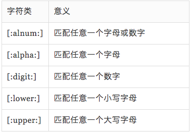
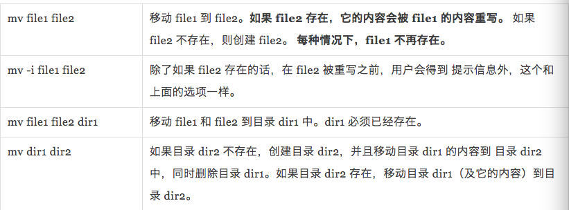
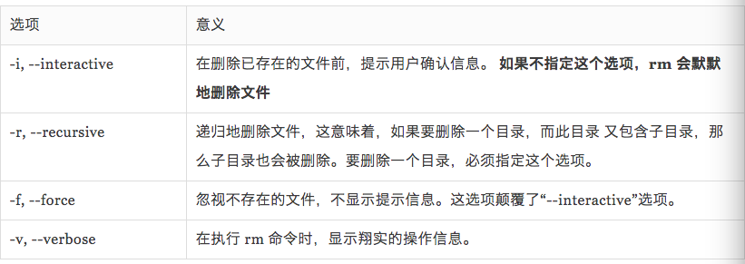

# 文件和目录等操作

- ## 基本操作

    - cp--复制

    - mv--移动或者是重命名

    - mkdir--创建一个目录文件(通俗讲也就是说创建一个目录只不过Linux处处皆文件故称之)

    - rm--删除文件

    - ln--创建硬连接

- ## 通配符

    > 通配符其实也就代称相当于css中的选择器

    - 通配符的匹配关键符号：<br><br> 

    - 通配符的关键符号的一些具体用法：<br><br>

    - 一些经典案例：<br><br>
- ## mkdir

    - 基本用法：`mkdir file1 file2 file3...`可以同时创建多个文件

- ## cp

    - 基本用法：<br><br>

    - 用法案例：<br><br>

- ## mv

    - 移动或者是重命名文件

    - opinions:<br><br>

    - 用法案例：<br><br>

- ## `rm`

    - rm含义是：删除文件或者目录

    - opinions<br><br>

    - example:<br><br>

- ## `rmdir`
    - 删除文件夹
    - opinions:
        - `-p`也就是删除输入路径的所有内容
        ```bash
        rmdir -p /s/ss
        ```
        - 这样的结果就是ss和s都没有了也就是
    - 删除文件和文件内所有内容不妨可以这么做`rmdir ./example/* `然后在`rmdir ./example`这样就没问题了不存在文件夹是空的啊或者是文件夹不是空的啊文件夹不是文件啊这种错误了 

- ## 
