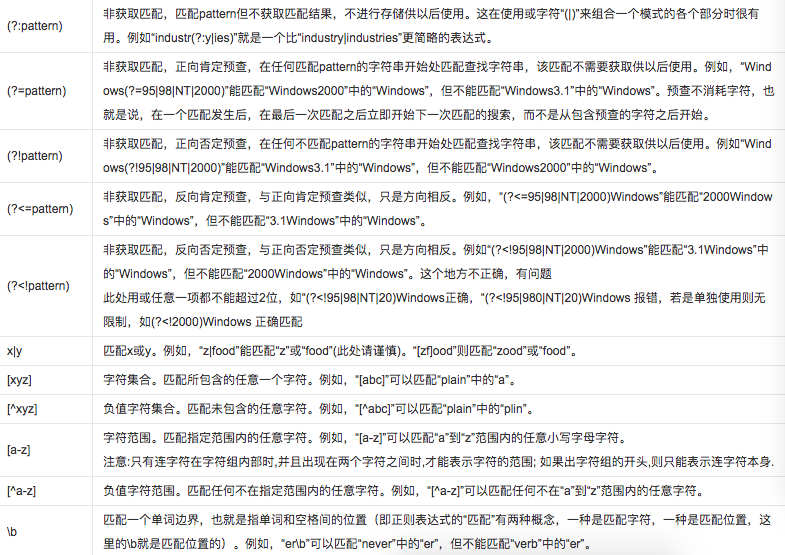

# 重头戏 --- 正则表达式
## [目录](./summary.md)
## 正则表达式表述：

正则表达式，又称规则表达式。（英语：Regular Expression，在代码中常简写为regex、regexp或RE），计算机科学的一个概念。正则表通常被用来检索、替换那些符合某个模式(规则)的文本。

**正则表达式的重要性：** 基本的正则语法是一样的，核心相同。正则表达式是独立于各种语言之外的，你在几乎任何的语言都能看到正则的身影，关键是它非常的方便啊！！！能快捷的解决很多问题啊，很爽啊，有木有！！！
> 不过话又说回来了，很多高级特性在不同语言中还是不同的。。。。。。
## 说起正则要提提 grep

grep的正确使用方式

`grep opinions regex file_name`

### grep 选项

|选项|	描述|
|-|-|
|-i|	忽略大小写。不会区分大小写字符。也可用--ignore-case 来指定。
|-v|	不匹配。通常，grep 程序会打印包含匹配项的文本行。这个选项导致 grep 程序 只会不包含匹配项的文本行。也可用--invert-match 来指定。
|-c|	打印匹配的数量（或者是不匹配的数目，若指定了-v 选项），而不是文本行本身。 也可用--count 选项来指定。
|-l|	打印包含匹配项的文件名，而不是文本行本身，也可用--files-with-matches 选项来指定。
|-L|	相似于-l 选项，但是只是打印不包含匹配项的文件名。也可用--files-without-match 来指定。
|-n|	在每个匹配行之前打印出其位于文件中的相应行号。也可用--line-number 选项来指定。
|-h|	应用于多文件搜索，不输出文件名。也可用--no-filename 选项来指定。

### 举例说明

```bash
grep -i a*.jpg newOne.text

bash
cat
date
domainname
hostname
launchctl
pax
wait4path
```
很明显这里忽略大小写，并且寻找开头是a然后结尾是.jpg的文件 并且在 newOne.text中寻找，但是很好的是，grep接受输入流，它可以| 并不像ls一样不接受输入流只接受“返回值”---参数。

## 元字符和文本

由以下字符组成各种正则`^ $ . [ ] { } - ? * + ( ) | \`
> 我们要把很多在shell中的字符转移是为什么呢？

原因其实很简单，这些字符例如说\\,它在shell中，有者特殊的含义，也就是说它是跟`if`这种是一个类型的，但是呢在re中它又有它本身的含义，这时候我们为了不让shell引擎解释它我们就需要使用''来让它定义为文本，或者使用`\`转移。

^ 头部

$ 尾部

例如 ^zip zip$ 头部 zip 和尾部 zip
## 小知识
[linux中自带的词典](../../picture/libary.md)

方法是：
```bash
touch libary.md

cat /usr/share/dict/words >> libary.md

```
## `.`
`.`的用法就是代指任意一个的字符。\*是代指一切东西，但是不能代替的是换行符`\n`

当该字符紧跟在任何一个其他限制符
\*,+,?，{n}，{n,}，{n,m}）后面时，匹配模式是非贪婪的。非贪婪模式尽可能少的匹配所搜索的字符串，而默认的贪婪模式则尽可能多的匹配所搜索的字符串。

## 中括号表达式和字符类[abc]
for example :
```bash
find -type d -name [apd]le \bin

```
意思就是寻找的是一个指定为目录，并且名字叫做ale或者是ple或者是dle的一个目录。

## 否定的括号[^abc]
for example
```bash
find -type f -and -name [^apple]le /bin
```
意思是在/bin目录下，我们要求这个find的寻找是 类型是文件 并且 名字是 开头不是apple的后面接上去是le的文件名。

## `*`
这个也是代指任意，但是它不分贪婪不贪婪，就是它是很随意的，比如谁ao*,它的意思就是说它可以匹配aoooo也可以匹配ao
## 注明所有的元符号的理论




